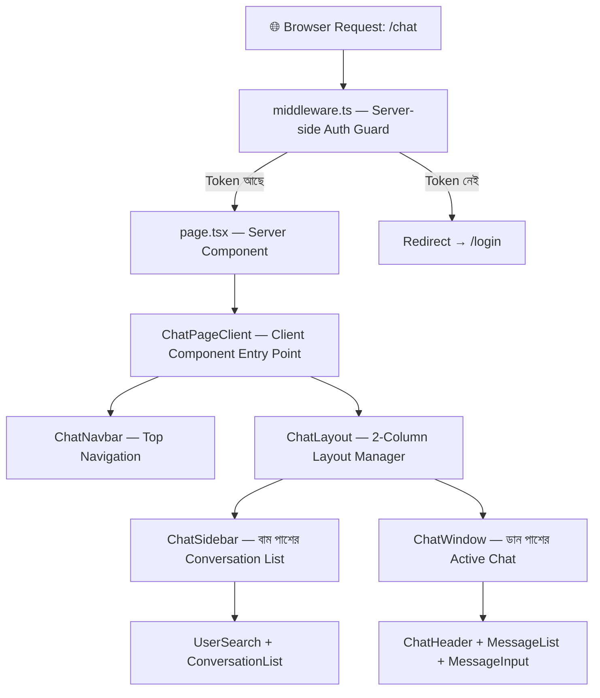
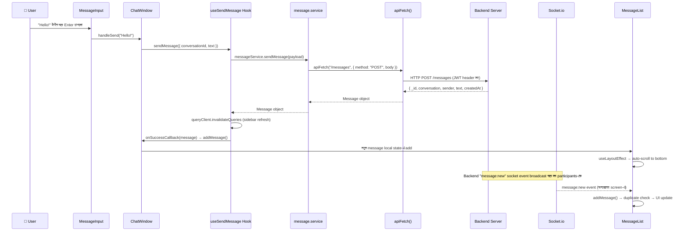

# 🗨️ Taghyeer Chat Feature — পুরো ব্যাখ্যা (বাংলায়)

> এই ডকুমেন্ট তোমাকে ইন্টারভিউ বোর্ডে chat feature পুরোটা explain করতে সাহায্য করবে। প্রতিটা ফাইল কী করে, কেন করে, কোন logic কোথায় আছে — সব এখানে বাংলায় আছে।

---

## 📐 Architecture Overview (আর্কিটেকচার ওভারভিউ)



**Architecture Flow:**
```
UI Components → Custom Hooks → Services → apiFetch / Socket.io
```

এটা মানে হলো:
1. **UI Components** (যেমন `ChatWindow`, `MessageList`) শুধু দেখায় (render)
2. **Custom Hooks** (যেমন `useConversationMessages`, `useSendMessage`) business logic handle করে
3. **Services** (যেমন `message.service.ts`, `conversation.service.ts`) API call করে
4. **apiFetch / Socket** হলো সবচেয়ে নিচের layer — সরাসরি backend-এ HTTP request বা WebSocket connection

---

## 🗂️ ফোল্ডার স্ট্রাকচার

```
src/
├── app/chat/
│   └── page.tsx                    ← Next.js Route (Server Component)
├── features/chat/
│   ├── types/
│   │   └── chat.types.ts           ← সব TypeScript Types/Interfaces
│   ├── services/
│   │   ├── chat-socket.service.ts  ← Socket.io event handling
│   │   ├── conversation.service.ts ← Conversation REST API calls
│   │   ├── message.service.ts      ← Message REST API calls
│   │   └── user.service.ts         ← User search API call
│   ├── hooks/
│   │   ├── useChatSocket.ts        ← Socket lifecycle + real-time sync
│   │   ├── useConversations.ts     ← Conversation CRUD hooks
│   │   ├── useConversationMessages.ts ← Message pagination + real-time
│   │   ├── useSendMessage.ts       ← Message send mutation
│   │   └── useUserSearch.ts        ← Debounced user search
│   └── components/
│       ├── ChatPageClient.tsx      ← মূল Client Component (entry)
│       ├── ChatLayout.tsx          ← 2-column layout + state management
│       ├── ChatNavbar.tsx          ← Top navigation bar
│       ├── ChatSidebar.tsx         ← বাম sidebar
│       ├── ChatWindow.tsx          ← ডান chat area
│       ├── ChatHeader.tsx          ← Chat header (name, actions)
│       ├── MessageList.tsx         ← Message display + auto-scroll
│       ├── MessageBubble.tsx       ← Individual message bubble
│       ├── MessageInput.tsx        ← Message typing + send
│       ├── ConversationList.tsx    ← Conversation items render
│       ├── ConversationItem.tsx    ← Single conversation card
│       └── ... (Dialogs/Modals)
├── lib/
│   ├── api.ts                     ← apiFetch() utility
│   ├── socket.ts                  ← Socket.io singleton
│   └── auth-token.ts             ← Token management
└── middleware.ts                  ← Server-side auth guard
```

---

## 🔐 ধাপ ১: Authentication Guard — [`middleware.ts`](file:///d:/new%20projects/taghyeer-home-task/src/middleware.ts)

### কী করে?
Server-side এ page render হওয়ার **আগেই** check করে user logged in কিনা।

### Logic:
```
User → /chat যেতে চায়
  ↓
middleware.ts check করে cookie তে "chatapp_token" আছে কিনা
  ↓
আছে → পেইজ দেখাও (next())
নেই → /login এ পাঠাও (redirect)
```

### ইন্টারভিউতে বলবে:
> "আমরা Next.js middleware ব্যবহার করেছি server-side authentication guard হিসেবে। এটা edge runtime-এ চলে, মানে page render হওয়ার আগেই cookie চেক করে। `/chat` route-এ token না থাকলে `/login`-এ redirect করে। এতে unauthorized user কোনো chat page-এর HTML ও দেখতে পায় না।"

---

## 🚪 ধাপ ২: Route Entry — [`page.tsx`](file:///d:/new%20projects/taghyeer-home-task/src/app/chat/page.tsx)

### কী করে?
Next.js App Router-এর server component। শুধু `ChatPageClient` render করে।

### কেন আলাদা?
Next.js-এ `page.tsx` হলো **Server Component** by default। কিন্তু chat-এ আমাদের `useState`, `useEffect`, socket connection ইত্যাদি দরকার যেটা শুধু **Client Component**-এ কাজ করে। তাই page.tsx শুধু একটা bridge — server component থেকে client component-এ হ্যান্ডঅফ করে।

### ইন্টারভিউতে বলবে:
> "`page.tsx` হলো Next.js App Router-এর entry point। এটা server component, তাই এখানে কোনো client-side logic নেই। এটা শুধু `ChatPageClient` component render করে যেটা `'use client'` directive দিয়ে মার্ক করা।"

---

## 🏠 ধাপ ৩: Client Entry — [`ChatPageClient.tsx`](file:///d:/new%20projects/taghyeer-home-task/src/features/chat/components/ChatPageClient.tsx)

### কী করে?
1. **Current user fetch করে** → `useCurrentUser()` hook দিয়ে
2. **Loading state দেখায়** → user data আসার আগে spinner দেখায়
3. **মূল layout render করে** → `ChatNavbar` (উপরে) + `ChatLayout` (নিচে)

### Logic Flow:
```
ChatPageClient mount হয়
  ↓
useCurrentUser() → API call করে current logged-in user fetch করে
  ↓
isLoading === true? → Loading spinner দেখাও
  ↓
user data এসে গেছে? → ChatNavbar + ChatLayout render করো
```

### ইন্টারভিউতে বলবে:
> "এটা আমাদের chat feature-এর মূল client-side entry point। এটা `useCurrentUser()` hook দিয়ে authenticated user-এর data fetch করে। Data আসার আগে একটা premium loading spinner দেখায়। Data এলে দুইটা child render করে — `ChatNavbar` (navigation bar) আর `ChatLayout` (main chat workspace)।"

---

## 📊 ধাপ ৪: Layout Manager — [`ChatLayout.tsx`](file:///d:/new%20projects/taghyeer-home-task/src/features/chat/components/ChatLayout.tsx)

> ⚠️ **এটা সবচেয়ে গুরুত্বপূর্ণ ফাইল — এখানে সব state management আছে।**

### কী করে?
1. **Selected conversation track করে** (`selectedConversationId` state)
2. **URL sync করে** (query param `?conversationId=xxx`)
3. **Socket connection initialize করে** (`useChatSocket`)
4. **Unread message count track করে** (`unreadMap` state)
5. **Responsive layout manage করে** (mobile-এ sidebar/chat toggle)

### State গুলো:

| State | কী রাখে | কেন দরকার |
|-------|---------|-----------|
| `selectedConversationId` | কোন conversation সিলেক্ট করা আছে | ডান পাশে কোন chat দেখাবে সেটা জানতে |
| `unreadMap` | `{ convId: count }` | কোন conversation-এ কয়টা unread message |
| `directMessageUser` | কাকে DM করতে চায় | DM modal খোলার জন্য |

### 🔥 Real-time Socket Logic:
```javascript
useChatSocket((msg) => {
  const convId = getConvId(msg);
  // যদি message অন্য conversation-এর হয় (active chat না), তাহলে unread count বাড়াও
  if (convId && convId !== selectedConversationId) {
    setUnreadMap(prev => ({
      ...prev,
      [convId]: (prev[convId] || 0) + 1,
    }));
  }
});
```

**মানে কী?**
- Socket থেকে নতুন message আসলো
- যদি সেটা **বর্তমানে active chat-এর** message হয় → কিছু করতে হবে না (MessageList নিজেই handle করবে)
- যদি সেটা **অন্য conversation-এর** message হয় → sidebar-এ unread badge দেখাও

### 📱 Responsive Logic:
```javascript
// Mobile-এ: conversation select করলে sidebar লুকাও, chat দেখাও
// Desktop-এ: দুইটাই পাশাপাশি দেখাও
className={cn(
  "w-full md:w-auto",
  selectedConversationId ? "hidden md:flex" : "flex"  // sidebar
)}
```

### URL Sync Logic:
```javascript
const updateUrlParam = (id) => {
  const url = new URL(window.location.href);
  if (id) url.searchParams.set("conversationId", id);
  else url.searchParams.delete("conversationId");
  window.history.replaceState(null, "", url.pathname + url.search);
};
```
**কেন?** ব্রাউজার refresh করলেও যেন সেই conversation-ই selected থাকে।

### ইন্টারভিউতে বলবে:
> "`ChatLayout` হলো আমাদের state management hub। এটা ৩টা main state manage করে — selected conversation, unread counts, আর DM modal target। Socket থেকে real-time message আসলে এটা check করে active conversation কিনা — যদি না হয় তাহলে unread badge বাড়ায়। Mobile responsive design-ও এখানেই — `md:flex` আর `hidden` class toggle করে sidebar/chat দেখায়/লুকায়। URL query param sync করে যাতে page refresh-এ conversation হারিয়ে না যায়।"

---

## 📋 ধাপ ৫: Sidebar — [`ChatSidebar.tsx`](file:///d:/new%20projects/taghyeer-home-task/src/features/chat/components/ChatSidebar.tsx)

### কী করে?
1. **User search bar** দেখায় (`UserSearch`)
2. **"Create Group" button** দেখায়
3. **Conversation list** দেখায় (`ConversationList`)
4. **Group creation dialog** manage করে

### ইন্টারভিউতে বলবে:
> "Sidebar-এ তিনটা section আছে — top-এ user search + group create button, মাঝে conversation counter header, আর নিচে scrollable conversation list। Group create button ক্লিক করলে `CreateGroupDialog` modal ওপেন হয়।"

---

## 📝 ধাপ ৬: Conversation List + Item

### [`ConversationList.tsx`](file:///d:/new%20projects/taghyeer-home-task/src/features/chat/components/ConversationList.tsx)
**Sorting Logic (গুরুত্বপূর্ণ!):**
```javascript
const sortedConversations = [...conversations].sort((a, b) => {
  const unreadA = unreadMap[a._id] || 0;
  const unreadB = unreadMap[b._id] || 0;
  if (unreadA !== unreadB) return unreadB - unreadA;  // unread আগে
  // সমান হলে সময় অনুযায়ী (নতুন আগে)
  return new Date(b.updatedAt).getTime() - new Date(a.updatedAt).getTime();
});
```
**মানে:** Unread message আছে এমন conversation সবার উপরে দেখাবে, তারপর বাকিগুলো সময় অনুযায়ী।

### [`ConversationItem.tsx`](file:///d:/new%20projects/taghyeer-home-task/src/features/chat/components/ConversationItem.tsx)
- Group হলে **Users icon** দেখায়, Direct হলে **UserAvatar** দেখায়
- **Last message preview** দেখায়
- **Unread badge** (bounce animation সহ) দেখায়
- **Selected state** আলাদা color-এ highlight করে

---

## 💬 ধাপ ৭: Chat Window — [`ChatWindow.tsx`](file:///d:/new%20projects/taghyeer-home-task/src/features/chat/components/ChatWindow.tsx)

### কী করে?
এটা ৩টা sub-component compose করে:
1. `ChatHeader` — উপরে conversation info + action buttons
2. `MessageList` — মাঝে message history
3. `MessageInput` — নিচে message typing area

### Logic:
```javascript
// Message history fetch করো (paginated + real-time)
const { messages, isLoading, hasMore, addMessage, loadOlderMessages } 
  = useConversationMessages(conversation._id);

// Message send mutation
const { mutate: sendMessage, isPending } = useSendMessage(
  (sentMsg) => addMessage(sentMsg)  // send হলে local list-এ add করো
);

const handleSend = (text) => {
  if (!text.trim()) return;
  sendMessage({ conversationId: conversation._id, text: text.trim() });
};
```

### ইন্টারভিউতে বলবে:
> "`ChatWindow` হলো active conversation-এর container। এটা দুইটা custom hook ব্যবহার করে — `useConversationMessages` (message history fetch + real-time socket sync + pagination) আর `useSendMessage` (REST API দিয়ে message send)। Send successful হলে `addMessage` callback দিয়ে local message list-এ optimistically add করে।"

---

## 📨 ধাপ ৮: Message System (সবচেয়ে Complex Logic)

### [`useConversationMessages.ts`](file:///d:/new%20projects/taghyeer-home-task/src/features/chat/hooks/useConversationMessages.ts) — Paginated Messages + Real-time

#### ৩টা মূল কাজ:

**কাজ ১: Initial Load**
```
Conversation select হলো
  ↓
messageService.getConversationMessages(convId, 20) — API call
  ↓
Response আসলো: { messages: [...], hasMore: true/false }
  ↓
messages reverse করো (API newest-first দেয়, আমরা oldest-first চাই)
  ↓
State-এ set করো
```

**কাজ ২: Older Messages Load (Scroll-up Pagination)**
```
User উপরে scroll করলো
  ↓
loadOlderMessages() call হয়
  ↓
সবচেয়ে পুরনো message-এর _id নিয়ে "before" cursor হিসেবে API-তে পাঠাও
  ↓
আসা messages reverse করে আগের messages-এর আগে জোড়া দাও
  ↓
setMessages(prev => [...older, ...prev])
```

**কাজ ৩: Real-time Socket Sync**
```
Socket থেকে "message:new" event আসলো
  ↓
chatSocketService.subscribeToNewMessage() listener fire হয়
  ↓
Check: message-টা কি এই conversation-এর?
  ↓
হ্যাঁ → addMessage() দিয়ে local list-এ append করো (duplicate check সহ)
```

### [`useSendMessage.ts`](file:///d:/new%20projects/taghyeer-home-task/src/features/chat/hooks/useSendMessage.ts) — Message Send

```
User "Send" button চাপলো
  ↓
useSendMessage hook → messageService.sendMessage(payload)
  ↓
REST API: POST /messages { conversationId, text }
  ↓
Success → ১) Conversations query invalidate (sidebar update)
          ২) Messages query cache update
          ৩) onSuccessCallback → addMessage() (UI-তে instantly দেখাও)
  ↓
Error → toast.error("Failed to send message")
```

### ইন্টারভিউতে বলবে:
> "Message system দুইভাবে কাজ করে — **REST API** দিয়ে message send হয়, আর **Socket.io** দিয়ে real-time receive হয়। `useConversationMessages` hook cursor-based pagination support করে — প্রথমবার ২০টা message আনে, user scroll up করলে `before` cursor দিয়ে আরো পুরনো message fetch করে। Real-time-এ socket `message:new` event listen করে, নতুন message আসলে duplicate check করে local state-এ append করে।"

---

## 📜 ধাপ ৯: MessageList Scroll Logic — [`MessageList.tsx`](file:///d:/new%20projects/taghyeer-home-task/src/features/chat/components/MessageList.tsx)

> ⚠️ এটা **সবচেয়ে tricky logic** — ইন্টারভিউতে এটা জানলে অনেক ইম্প্রেস হবে।

### ৩টা Scroll Scenario:

| Scenario | কখন হয় | কী করে |
|----------|---------|--------|
| **Initial Load** | প্রথমবার conversation select | Instantly bottom-এ jump (no animation) |
| **New message + User bottom-এ** | নতুন message + user bottom-এ scroll করা | Smoothly bottom-এ scroll |
| **New message + User scroll up** | নতুন message + user পুরনো message পড়ছে | Scroll করে না, "New messages" button দেখায় |

### `useLayoutEffect` কেন ব্যবহার করা হয়েছে?

```javascript
useLayoutEffect(() => {
  // Pagination scroll restoration
  if (paginationInProgressRef.current) {
    // পুরনো messages load হলে scroll position restore করো
    // যাতে user যে message দেখছিলো সেটা জায়গায় থাকে
    container.scrollTop = container.scrollHeight - prevScrollHeightRef.current;
    return;
  }
  
  // Initial load → instantly bottom-এ যাও
  if (isInitial && messages.length > 0) {
    container.scrollTop = container.scrollHeight;
    return;
  }
  
  // নতুন message এসেছে
  if (addedCount > 0) {
    if (isNearBottom || isSelf) {
      // User bottom-এ আছে বা নিজে পাঠিয়েছে → smooth scroll to bottom
      container.scrollTo({ top: container.scrollHeight, behavior: "smooth" });
    } else {
      // User scroll up করা আছে → "New messages" button দেখাও
      setShowScrollButton(true);
      setUnreadCount(prev => prev + addedCount);
    }
  }
}, [messages]);
```

**`useLayoutEffect` vs `useEffect` পার্থক্য:**
- `useLayoutEffect` DOM update-এর **পরে** কিন্তু browser paint-এর **আগে** চলে
- এতে scroll position change visual flash/jump ছাড়াই হয়
- `useEffect` ব্যবহার করলে user একটা flash দেখতো — "আগে messages উপরে দেখালো, তারপর নিচে লাফ দিলো"

### Pagination Scroll Restoration:
```
User scroll up করে top-এ পৌঁছালো
  ↓
handleScroll() → scrollTop < TOP_THRESHOLD (100px)
  ↓
triggerLoadOlder() call
  ↓
prevScrollHeightRef.current = container.scrollHeight (আগের height save)
  ↓
Older messages আসলো → useLayoutEffect fire হয়
  ↓
container.scrollTop = container.scrollHeight - prevScrollHeightRef.current
  ↓
User ঠিক আগে যে message দেখছিলো সেটাই দেখতে পায় — কোনো jump নেই!
```

### ইন্টারভিউতে বলবে:
> "MessageList-এ `useLayoutEffect` ব্যবহার করেছি scroll management-এর জন্য। এটা DOM update-এর পরে কিন্তু paint-এর আগে চলে, তাই zero-flash experience দেয়। তিনটা scenario handle করে — initial load-এ instant bottom jump, নতুন message-এ smart auto-scroll (bottom-এ থাকলে scroll করে, scroll up থাকলে unread indicator দেখায়), আর pagination-এ scroll position restore করে যাতে visual jump না হয়।"

---

## 🔌 ধাপ ১০: Socket.io Real-time System

### ৩ Layer আছে:

### Layer 1: [`socket.ts`](file:///d:/new%20projects/taghyeer-home-task/src/lib/socket.ts) — Singleton Socket Instance

```javascript
// Singleton Pattern — পুরো app-এ একটাই socket connection
let socketInstance: Socket | null = null;

function getSocket(authToken?) {
  const token = authToken || getAccessToken();  // Cookie থেকে JWT নাও
  if (!token) return null;  // Token নেই? Connect করো না
  
  if (!socketInstance) {
    socketInstance = io(SOCKET_URL, {
      auth: { token },          // JWT handshake-এ পাঠাও
      transports: ["websocket", "polling"],  // WebSocket try করো, fail হলে polling
      reconnection: true,       // Disconnect হলে auto-reconnect
      reconnectionAttempts: 10, // ১০ বার try করো
    });
  }
  return socketInstance;
}
```

### Layer 2: [`chat-socket.service.ts`](file:///d:/new%20projects/taghyeer-home-task/src/features/chat/services/chat-socket.service.ts) — Event Handlers

```javascript
// Raw socket payload normalize করে standard Message format-এ
function normalizeSocketMessage(raw) {
  return {
    _id: raw._id || raw.id || String(Date.now()),
    conversation: raw.conversation,
    sender: raw.sender,
    text: raw.text,
    createdAt: /* ISO string-এ convert */,
  };
}

// ২টা subscription function:
// 1. subscribeToNewMessage → "message:new" event শোনে
// 2. subscribeToConversationUpdated → "conversation:updated" event শোনে
```

### Layer 3: [`useChatSocket.ts`](file:///d:/new%20projects/taghyeer-home-task/src/features/chat/hooks/useChatSocket.ts) — React Integration

```javascript
function useChatSocket(onNewMessage?, authToken?) {
  // React 18 useSyncExternalStore — socket connected কিনা track করে
  const isConnected = useSyncExternalStore(
    subscribeSocketState,
    isSocketConnected,
    () => false  // Server-side fallback
  );
  
  useEffect(() => {
    const socket = getSocket(authToken);
    
    // conversation:updated → conversation list refresh করো
    chatSocketService.subscribeToConversationUpdated(() => {
      queryClient.invalidateQueries({ queryKey: CONVERSATIONS_QUERY_KEY });
    });
    
    // message:new → conversation list refresh + unread count update
    chatSocketService.subscribeToNewMessage((msg) => {
      queryClient.invalidateQueries({ queryKey: CONVERSATIONS_QUERY_KEY });
      if (onNewMessage) onNewMessage(msg);
    });
    
    return () => { /* cleanup listeners */ };
  }, [authToken, queryClient, onNewMessage]);
}
```

### ইন্টারভিউতে বলবে:
> "Socket system তিন layer-এ ভাগ করা — `socket.ts` হলো singleton Socket.io instance (JWT auth দিয়ে connect হয়), `chat-socket.service.ts` হলো event handler layer (raw payload normalize করে standard format-এ), আর `useChatSocket` hook হলো React integration layer (socket events-কে React Query cache invalidation-এর সাথে connect করে)। `useSyncExternalStore` ব্যবহার করেছি connection status track করতে যেটা React 18-এর concurrent mode-safe API।"

---

## 🌐 ধাপ ১১: REST API Layer

### [`api.ts`](file:///d:/new%20projects/taghyeer-home-task/src/lib/api.ts) — Central HTTP Client

```javascript
async function apiFetch<T>(endpoint, options = {}) {
  const token = getAccessToken();  // Cookie/localStorage থেকে JWT
  
  const headers = {
    Accept: "application/json",
    Authorization: `Bearer ${token}`,  // প্রতি request-এ token পাঠাও
    "Content-Type": "application/json", // body থাকলে
  };
  
  const response = await fetch(url, { method, headers, body: JSON.stringify(body) });
  
  if (!response.ok) throw new ApiError(status, data);  // Error handling
  return data as T;  // Generic type-safe response
}
```

### Services যেগুলো `apiFetch` ব্যবহার করে:

| Service | API Endpoints | কী করে |
|---------|--------------|--------|
| [`conversation.service.ts`](file:///d:/new%20projects/taghyeer-home-task/src/features/chat/services/conversation.service.ts) | `GET /conversations`, `POST /conversations`, `POST /conversations/group`, etc. | Conversation CRUD |
| [`message.service.ts`](file:///d:/new%20projects/taghyeer-home-task/src/features/chat/services/message.service.ts) | `GET /conversations/:id/messages`, `POST /messages` | Message fetch + send |
| [`user.service.ts`](file:///d:/new%20projects/taghyeer-home-task/src/features/chat/services/user.service.ts) | `GET /users/search?q=xxx` | User search |

---

## 🔄 ধাপ ১২: React Query — Data Fetching + Caching

### [`useConversations.ts`](file:///d:/new%20projects/taghyeer-home-task/src/features/chat/hooks/useConversations.ts)

এই **একটা ফাইলে ৭টা hook** আছে:

| Hook | কী করে | API |
|------|--------|-----|
| `useConversations()` | সব conversation fetch করে | GET /conversations |
| `useCreateConversation()` | নতুন 1-on-1 chat তৈরি | POST /conversations |
| `useCreateGroupConversation()` | নতুন group তৈরি | POST /conversations/group |
| `useAddParticipants()` | Group-এ member যোগ | POST /conversations/:id/participants |
| `useRemoveParticipant()` | Group থেকে member বাদ | DELETE /conversations/:id/participants/:userId |
| `usePromoteAdmin()` | Member-কে admin বানাও | POST /conversations/:id/admins |
| `useRenameGroup()` | Group rename করো | PATCH /conversations/:id |

**প্রতিটা mutation-এর pattern একই:**
```
mutationFn → API call
onSuccess → queryClient.invalidateQueries() + toast.success()
onError → toast.error()
```

### ইন্টারভিউতে বলবে:
> "React Query (TanStack Query) ব্যবহার করেছি server state management-এর জন্য। `useQuery` দিয়ে conversation list fetch করি `staleTime: 60s` সহ। `useMutation` দিয়ে সব CRUD operation handle করি। প্রতিটা mutation success-এ `invalidateQueries` call করে conversation list re-fetch trigger করে, যাতে sidebar সবসময় up-to-date থাকে।"

---

## 🔍 ধাপ ১৩: User Search — Debounce Logic

### [`useUserSearch.ts`](file:///d:/new%20projects/taghyeer-home-task/src/features/chat/hooks/useUserSearch.ts)

```javascript
// Debounce: user টাইপ করা শেষ না হলে API call করবে না
function useDebounce(value, delayMs = 300) {
  const [debouncedValue, setDebouncedValue] = useState(value);
  useEffect(() => {
    const timer = setTimeout(() => setDebouncedValue(value), delayMs);
    return () => clearTimeout(timer); // নতুন keystroke → আগের timer cancel
  }, [value, delayMs]);
  return debouncedValue;
}

function useUserSearch(searchTerm) {
  const debouncedQuery = useDebounce(searchTerm.trim(), 350);
  return useQuery({
    queryKey: ["users", "search", debouncedQuery],
    queryFn: () => userService.searchUsers(debouncedQuery),
    enabled: debouncedQuery.length >= 1,  // ১ character-এর কম হলে search করবে না
  });
}
```

**Debounce কেন?**
User "Jowel" টাইপ করলে — "J", "Jo", "Jow", "Jowe", "Jowel" — ৫টা keystroke, কিন্তু debounce না থাকলে ৫টা API call যেত। Debounce দিলে **শেষ keystroke-এর ৩৫০ms পরে ১টাই** API call যায়।

---

## 🧩 ধাপ ১৪: Type System — [`chat.types.ts`](file:///d:/new%20projects/taghyeer-home-task/src/features/chat/types/chat.types.ts)

### মূল Types:

```typescript
// একটা Conversation কেমন দেখতে
interface Conversation {
  _id: string;
  type: "direct" | "group";      // ১-অন-১ নাকি গ্রুপ
  name?: string;                  // গ্রুপের নাম
  participants?: Participant[];   // সদস্যরা
  participant?: Participant;      // Direct chat-এ অন্যজন
  lastMessage?: LastMessage;      // শেষ মেসেজ (sidebar preview)
  admins?: string[];              // গ্রুপ অ্যাডমিনদের ID
  updatedAt: string;              // কখন update হয়েছে (sorting-এ ব্যবহার হয়)
}

// একটা Message কেমন দেখতে
interface Message {
  _id: string;
  conversation: string;  // কোন conversation-এর message
  sender: string;        // কে পাঠিয়েছে
  text: string;          // message content
  createdAt: string;     // কখন পাঠানো হয়েছে
}

// Socket থেকে আসা raw message (normalize করতে হয়)
interface SocketMessagePayload {
  id?: string;          // backend কখনো 'id' পাঠায়
  _id?: string;         // কখনো '_id' পাঠায়
  conversation: string;
  sender: string;
  text: string;
  createdAt: string | number;  // string বা timestamp হতে পারে
}
```

---

## 🔗 পুরো Data Flow Diagram — "Message Send" Example



---

## 📌 Interview-এ সবচেয়ে Important Points Summary

### ১. Architecture Pattern
> "Feature-based modular architecture ব্যবহার করেছি। প্রতিটা feature (`chat`, `auth`) আলাদা ফোল্ডারে — components, hooks, services, types সব ভাগ করা। Data flow হলো: **UI → Hooks → Services → API/Socket**।"

### ২. Real-time + REST দুটো কেন?
> "Message **send** করার জন্য REST API (POST /messages) ব্যবহার করি কারণ এটা reliable, retry করা যায়, error handling সহজ। কিন্তু **receive** করার জন্য Socket.io ব্যবহার করি কারণ real-time notification দরকার — অন্যজন message পাঠালে instantly দেখাতে হবে।"

### ৩. Scroll Management কেন Complex?
> "তিনটা scenario আছে — initial load, new message, pagination। `useLayoutEffect` ব্যবহার করেছি কারণ এটা paint-এর আগে চলে — তাই scroll jump visually দেখা যায় না। Pagination-এ আগের scrollHeight save করে restore করি।"

### ৪. React Query কেন?
> "Server state (conversations, messages) manage করার জন্য। Cache, stale time, background refetch, mutation + cache invalidation — এসব built-in পাই। Socket event আসলে `invalidateQueries()` call করলেই UI auto-update হয়।"

### ৫. Singleton Socket কেন?
> "পুরো app-এ একটাই socket connection থাকা উচিত — multiple connection resource waste আর conflict করে। `getSocket()` function singleton pattern follow করে — instance না থাকলে বানায়, থাকলে আগেরটাই return করে।"

### ৬. Debounce কেন?
> "User search-এ প্রতি keystroke-এ API call অপ্রয়োজনীয়। ৩৫০ms debounce দিয়ে শেষ keystroke-এর পরে একবারই API call যায়। এতে backend load কমে, UX smooth হয়।"
